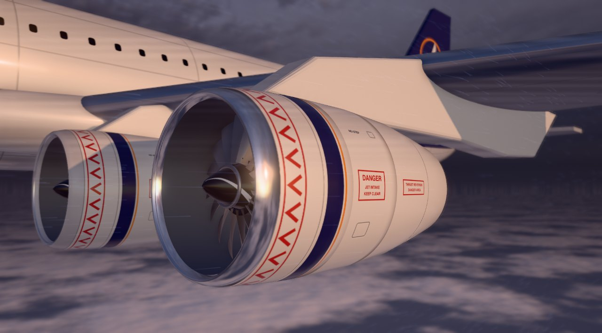
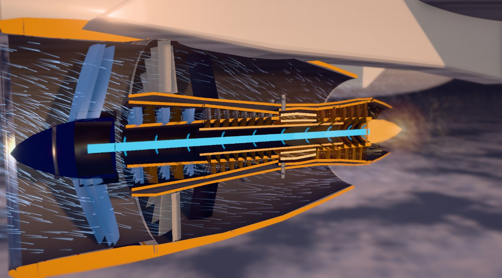
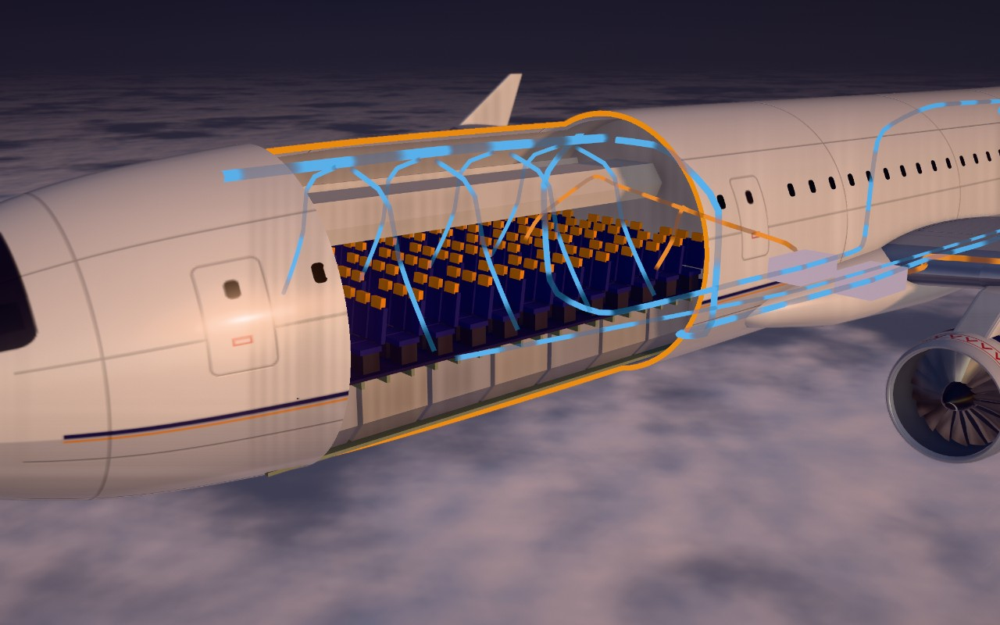
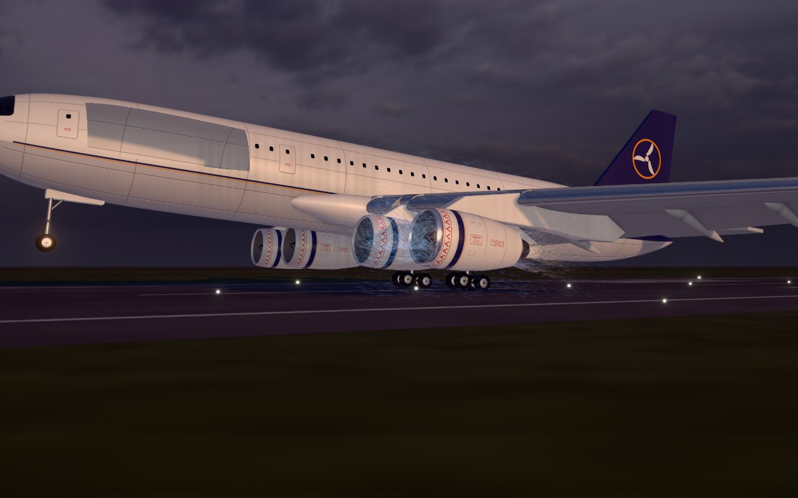
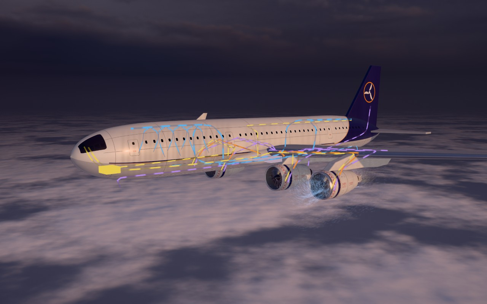

# Turbofan Explorer

A 3D modelling project in Three.js: a turbofan engine and the airliner it hangs from, modelled
entirely in code and made into an interactive lesson on how a jet engine works (*suck, squeeze,
bang, blow*) and what it powers.



Every model here is procedural: the engine down to each ring of blades, the aircraft with its
moving slats, flaps and spoilers, the landing gear, the cabin with its seats and cargo hold, and the
runway. There are no imported 3D model files. The livery is SVG artwork in `public/livery/`. The
sky is a photograph in `public/sky/`: Belfast Sunset (Pure Sky) by Dimitrios Savva and Jarod Guest,
from Poly Haven (CC0).

| | |
| --- | --- |
|  |  |
|  |  |

The models are wrapped in a scroll story, a hands-on engine, four games and a tour of the aircraft
that ends with a landing.

The engine lesson is a recreation of a demo by @techartist_. The realistic look (lighting,
materials, livery, post-processing) came from a Claude Design study.

## Run

```bash
npm install
npm run dev
```

Then open http://localhost:5173.

- `npm run build` writes a static site to `dist/` with relative paths, so it can sit in any folder.
- `npm run preview` serves that build.

Handy links while working:

| Link | Opens |
| --- | --- |
| `/` | the story |
| `/?mode=explore`, `/?mode=play`, `/?mode=aircraft` | that tab |
| `/?mode=tour` or `/?t=12.5` | the film (paused at that second if `t` is given) |
| `/?film=aircraft&t=21` | the second film |
| `/?part=combustor` | a part's details in Explore |
| `/?mode=play&game=start` | a game: `quiz`, `build`, `start` or `fault` |
| `/?mode=aircraft&view=cabin` | an aircraft view: `overview`, `wing`, `cabin`, `cockpit` |
| `&quality=high` (or `medium`, `low`) | a fixed graphics preset |

## What is in it

**Story** (the front page). Scrolling drives the lesson: the engine first, then, after an interlude,
what the engines power, told as one landing. Three steps have a "try it" slider that takes the cut,
the throttle or the exploded view out of the scroll's hands while you are on that step. The page
ends with buttons into the other tabs and a "How it was made" section.

**Watch.** The same two films played against the clock, with a scrub bar: *The engine* (30 s) and
*The aircraft* (32 s).

**Explore.** The engine, hands on:

- **Throttle**, with gauges for fan speed, core speed, exhaust temperature, thrust and fuel.
- **Cutaway** and **Pull apart** sliders, and an **X-ray** switch.
- **Click a part** for a details card.
- **Graph** of pressure, temperature and gas speed along the engine.
- **Ride the air** through the core or around it.
- **Turbofan / Turbojet**, the **thrust reverser**, and an **afterburner** (as on fighter jets).
- **Altitude**, from 12 km down to standing on the runway: the air thins, thrust and fuel fall.

**Play.** Four games:

- *Name the part*: three rounds (jobs, materials, numbers).
- *Build the engine*: seven pieces, or nine with no hints and a time penalty.
- *Start the engine*: bleed air, starter, ignition, fuel, in the right order at the right moments.
  Get it wrong and you get a hot, wet, torching or hung start, with the reason.
- *Find the fault*: six failures (bird strike, surge, flame-out, turbine blade, broken shaft,
  unlocked reverser) shown by symptoms; click the part to blame.

**Aircraft.** The whole machine, with markers into three closer views:

- *Wing and wheels*: landing gear, slats and flaps, spoilers, reversers, and a runway to put it on.
- *Cabin*: the fuselage cut open over seats and cargo hold, with the air path drawn through it.
- *Flight deck*: a thrust lever and engine display driving the cut-open engine.
- Coloured lines show where the engines' bleed air, hydraulic power and electricity go.

**Also:** a **flight log** of what you have done (kept in the browser, nothing is sent anywhere)
with a certificate you can save as a picture, and a **scale figure**.

**Graphics** (under Engine controls): Full, Balanced or Light. If frames run slow the page steps
down a preset by itself, until you pick one by hand.

**Phones and tablets**: panels and cards become sheets along the bottom, the tools fold into a
"more" menu, and labels shrink to part names. The Engine controls box is not shown at these sizes,
so the automatic step-down sets the graphics there.

## Things to know before publishing

- **Link previews** use `public/share.jpg`. Sites that build previews need the image's full
  address: once the site has a home, change `share.jpg` in the `og:image` line of `index.html` to
  the complete URL.
- **The numbers are illustrative**: typical of a large airliner and its engine, rounded, and not
  any one real type. They come from `src/model.js`, `src/sim/start.js` and the text in `src/data/`.
- **"How it was made"** at the foot of the story (`index.html`, the `.making` section) is the place
  for your own words and name.

## How it is organised

| File | What it does |
| --- | --- |
| `index.html` | The one page: every tab's panels, and the story's text |
| `src/main.js` | The controller: modes, camera, selection, and each mode's view per frame |
| `src/experience.js` | Everything that draws. Takes a "view" object each frame and makes the scene match |
| `src/post.js` | The render pipeline: base pass, ambient occlusion, overlays, heat haze, depth of field, bloom |
| `src/films.js` | The two films. `config.js` + `timeline.js` + `tourview.js` are the engine film, `aircraftFilm.js` the aircraft one |
| `src/model.js` | The engine numbers: throttle, altitude and afterburner to gauges; values along the gas path |
| `src/sim/start.js` | The engine-start simulation (plain logic, no drawing) |
| `src/data/` | Card text, quiz questions, build pieces, fault scenarios, aircraft views |
| `src/scene/engine.js` | The turbofan, part by part, with the reverser, turbojet morph and x-ray |
| `src/scene/airframe.js` | Every aircraft measurement in one place |
| `src/scene/aircraft.js` | Assembles the aircraft from `wing.js`, `gear.js`, `cabin.js`, `systems.js` |
| `src/scene/ground.js` | The runway, its lights and tyre smoke |
| `src/scene/airflow.js`, `effects.js` | GPU air streaks; flame, plume, sparks, afterburner |
| `src/scene/environment.js` | Sky, cloud deck, sun and shadows |
| `src/scene/palette.js`, `materials.js`, `livery.js` | Material values, materials, and the livery artwork as textures |
| `src/ui/story.js` | The scroll story |
| `src/ui/play.js`, `sims.js` | The four games |
| `src/ui/plane.js`, `cockpit.js` | The Aircraft tab's panel and markers; the flight deck panel |
| `src/ui/log.js` | The flight log and certificate |
| `src/ui/` (others) | Transport bar, labels, part picker, cards, Explore panel, graph, ride |
| `docs/` | The build plan and reference pictures |

## How a few things work

**The models.** Round parts (cowls, casings, shafts, the fuselage, tyres) are surfaces of revolution
swept from a profile. Blades come from one generator that twists and tapers an aerofoil from root to
tip, copied around the axis. The wing is lofted from aerofoil sections along a tapered, swept
planform and split along its hinge lines into slats, flaps and spoilers that really move; the far
wing is the near one mirrored. Seats are one small model drawn 130 times. Measurements live in
`src/scene/airframe.js`, so the gear, the cabin and the system lines all agree with the airframe.

**One view, many modes.** The scene never reads the timeline or the UI directly. Each frame the
current mode fills in a plain "view" object (how far the cut is, the throttle, gear and flaps, what
is highlighted) and `experience.js` draws it. Films set those values straight from time, so
scrubbing and scrolling are exact. The hands-on modes ease towards their targets.

**The cutaway.** Walls are closed shells. A clip plane slices them, and a second copy of each wall
draws only its back faces in flat orange. Wherever the plane cuts through metal you see a section,
with no cap geometry. The cabin uses the same trick with three planes, so only a window of skin is
removed.

**The landing.** The aircraft never moves. The runway slides under it and rises to meet the wheels,
and the whole aircraft pitches about its main wheels. Time is compressed: the roll-out takes about
half as long as a real one.

**The look.** A photographic sky lights the scene and one low sun casts the shadows, so the exposure
is low (about 0.18). Anything that is not lit by them, such as the orange section faces, glowing
metal, flames, system lines and runway lights, is scaled in `experience.js` (`calibrate`) so it
stays as bright as it was drawn.

**Highlighting one part.** Each part owns private copies of its materials, so it can be dimmed or
lit without touching its neighbours. X-ray uses the same idea to ghost just the outer shells.
