<div align="center">


# Turbofan Explorer

**A Jet Engine and Its Airliner, Modelled in Code**

A procedural 3D modelling project: a turbofan engine and the four-engine airliner it hangs from,
built entirely in Three.js with no imported model files, then turned into an interactive lesson on
how a jet engine works.

[](https://threejs.org)
[](https://vite.dev)
[](https://developer.mozilla.org/docs/Web/API/WebGL_API)
[](https://developer.mozilla.org/docs/Web/JavaScript)
[](#-how-the-models-are-made)

### [✈️ Live demo →](https://claudiu1910.github.io/turbofan-explorer/)

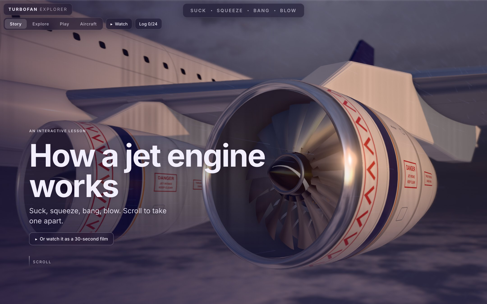

</div>

## ✨ Highlights

- **Every model is made in code.** The engine down to each ring of blades, the fuselage, the wings,
  the landing gear, the cabin and the runway are generated from profiles and measurements when the
  page loads. There is not a single imported 3D model file.
- **An engine you can cut open.** Slice it along its length, pull it apart along its shaft, x-ray
  it, or click any of its eleven parts for what it does, what it is made of and its numbers.
- **A wing that works.** Slats, flaps and ten spoilers move on their own hinges, the reverser
  sleeves slide back, and the landing gear folds away behind its doors.
- **A cabin behind the skin.** Open a window in the fuselage over 130 seats, the overhead bins and
  the cargo hold, with the air the engines supply drawn flowing through it.
- **One landing to tie it together.** Gear down, flaps out, touchdown in a puff of tyre smoke,
  spoilers up, reversers open, brakes glowing.
- **A lesson around the models.** A scroll-driven story, two short films, a hands-on engine with
  throttle, altitude and afterburner, and four games: name the part, build the engine, start the
  engine, find the fault.
- **Built to be kind to devices.** Three graphics presets, and the page steps down by itself if
  frames run slow. Phones and tablets get their own layout.

## 📸 Tour

| Cut open | Any part, close up |
| :---: | :---: |
| 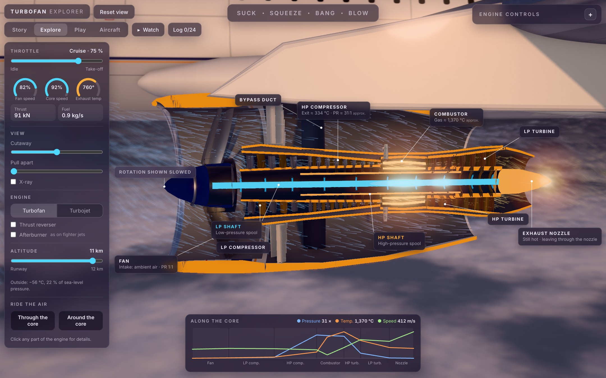 | 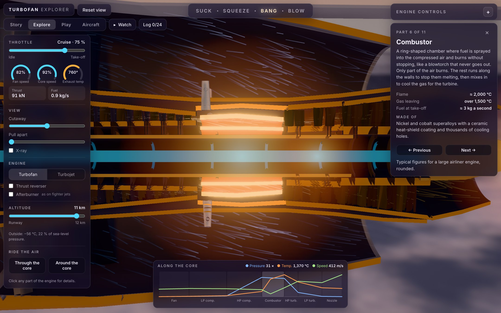 |
| **Pulled apart** | **What the engines power** |
| 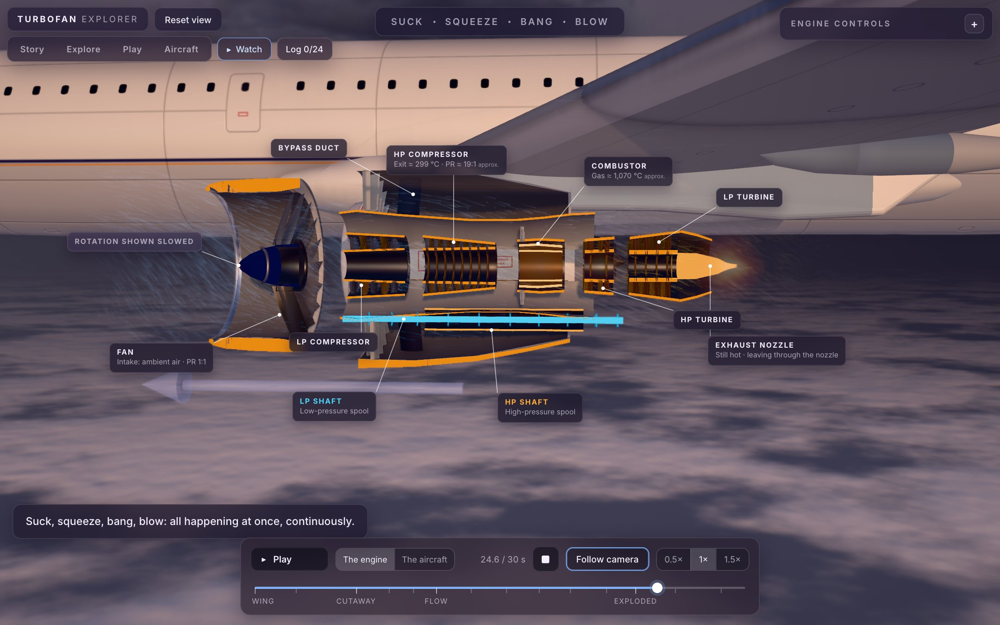 | 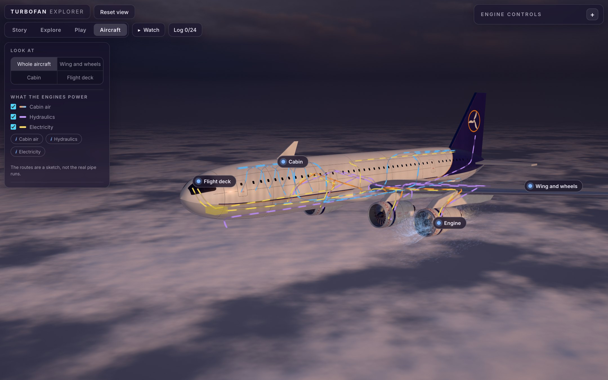 |
| **The cabin** | **Wing and wheels** |
| 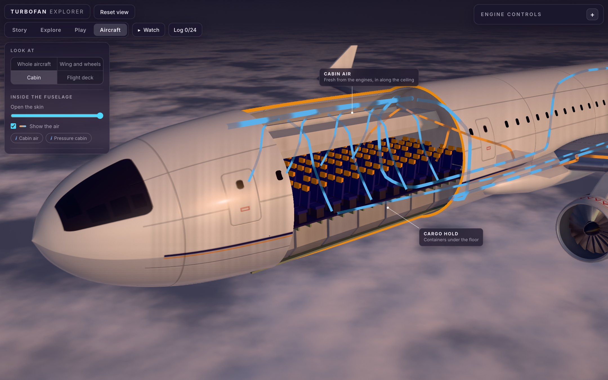 | 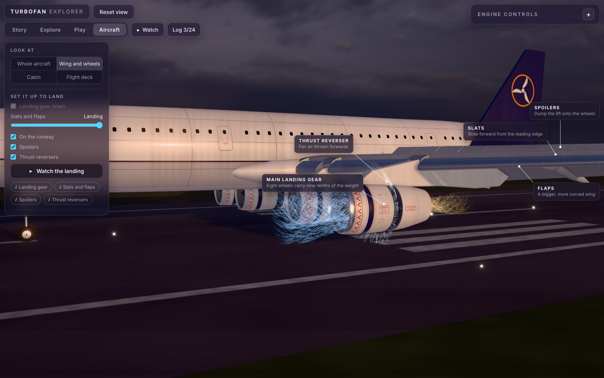 |
| **Touchdown** | **Start the engine** |
| 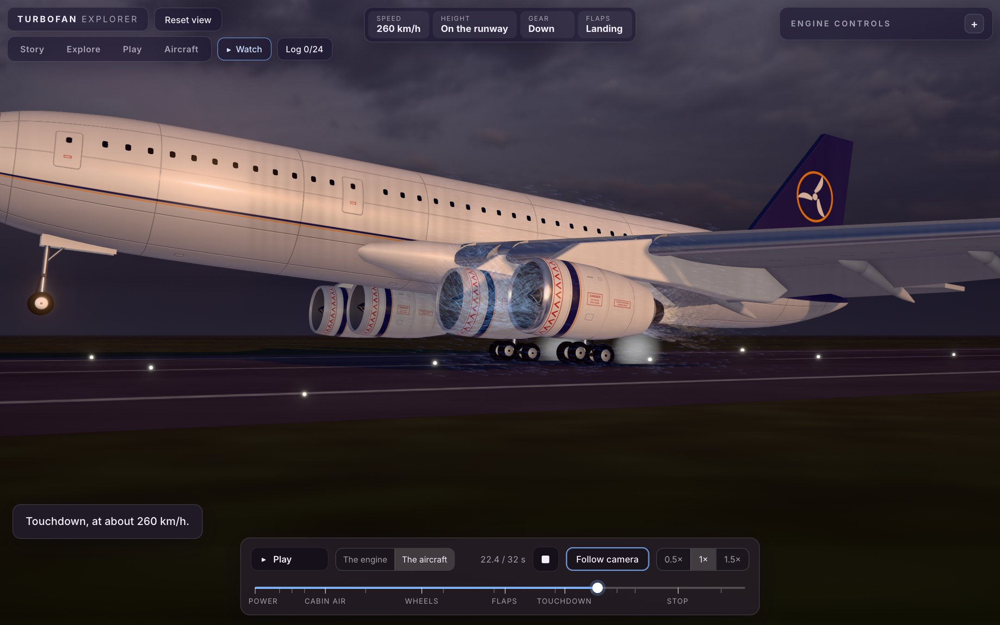 | 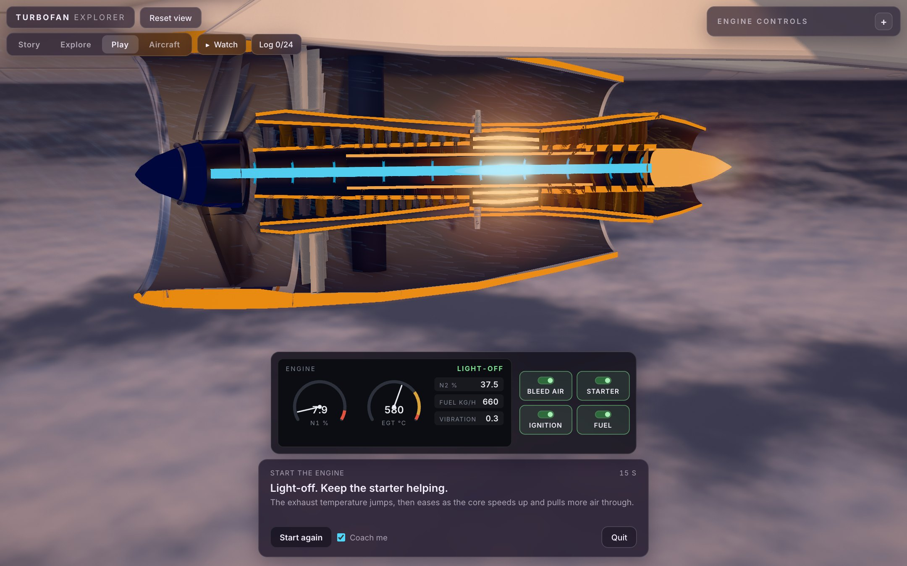 |
| **Find the fault** | **On your phone** |
| 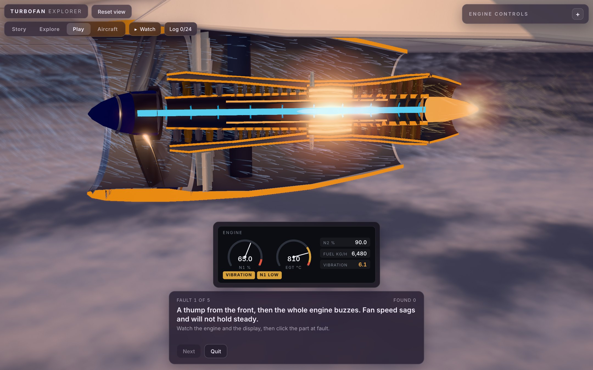 | 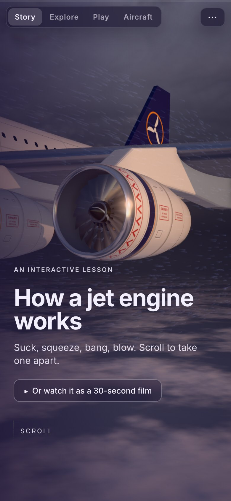 |

## 🚀 Run it on your computer

You need [Node.js](https://nodejs.org) **20.19 or newer** (check with `node -v`).

```bash
git clone https://github.com/claudiu1910/turbofan-explorer.git
cd turbofan-explorer
npm install
npm run dev
```

Then open **http://localhost:5173**. Edits you make to the files show up in the browser instantly.

| Command | What it does |
| --- | --- |
| `npm run dev` | Starts the development server with live reload |
| `npm run build` | Creates the finished static site in `dist/` |
| `npm run preview` | Serves that finished site |

Links that jump straight to one place (they work on the live demo too):

| Link | Opens |
| --- | --- |
| `/` | The story |
| `/?mode=explore`, `/?mode=play`, `/?mode=aircraft` | That tab |
| `/?mode=tour` or `/?t=12.5` | The film (paused at that second if `t` is given) |
| `/?film=aircraft&t=21` | The second film |
| `/?part=combustor` | A part's details in Explore |
| `/?mode=play&game=start` | A game: `quiz`, `build`, `start` or `fault` |
| `/?mode=aircraft&view=cabin` | An aircraft view: `overview`, `wing`, `cabin`, `cockpit` |
| `&quality=high` (or `medium`, `low`) | A fixed graphics preset |

## 🌍 How it is published

The live demo is hosted on [GitHub Pages](https://pages.github.com). The file
`.github/workflows/deploy.yml` rebuilds the site and publishes it every time something is pushed to
the `main` branch, so the demo always matches the code here.

The build uses relative paths, so the contents of `dist/` also work from any folder on any static
host.

## 🧭 What is in it

**Story** (the front page). Scrolling drives the lesson: the engine first, then, after an
interlude, what the engines power, told as one landing. Three steps have a "try it" slider that
takes the cut, the throttle or the exploded view out of the scroll's hands while you are on that
step.

**Watch.** The same two films played against the clock, with a scrub bar: *The engine* (30 s) and
*The aircraft* (32 s).

**Explore.** The engine, hands on:

- **Throttle**, with gauges for fan speed, core speed, exhaust temperature, thrust and fuel.
- **Cutaway** and **Pull apart** sliders, and an **X-ray** switch.
- **Click a part** for a details card.
- **Graph** of pressure, temperature and gas speed along the engine.
- **Ride the air** through the core or around it.
- **Turbofan / Turbojet**, the **thrust reverser**, and an **afterburner** (as on fighter jets).
- **Altitude**, from 12 km down to standing on the runway: the air thins, thrust and fuel fall.

**Play.** Four games:

- *Name the part*: three rounds (jobs, materials, numbers).
- *Build the engine*: seven pieces, or nine with no hints and a time penalty.
- *Start the engine*: bleed air, starter, ignition, fuel, in the right order at the right moments.
  Get it wrong and you get a hot, wet, torching or hung start, with the reason.
- *Find the fault*: six failures (bird strike, surge, flame-out, turbine blade, broken shaft,
  unlocked reverser) shown by symptoms; click the part to blame.

**Aircraft.** The whole machine, with markers into three closer views:

- *Wing and wheels*: landing gear, slats and flaps, spoilers, reversers, and a runway to put it on.
- *Cabin*: the fuselage cut open over seats and cargo hold, with the air path drawn through it.
- *Flight deck*: a thrust lever and engine display driving the cut-open engine.
- Coloured lines show where the engines' bleed air, hydraulic power and electricity go.

**Also:** a **flight log** of what you have done (kept in your browser, nothing is sent anywhere)
with a certificate you can save as a picture.

## 🗂️ Project structure

```text
index.html                  The one page: every tab's panels, and the story's text
src/
  main.js                   The controller: modes, camera, selection, each mode's view per frame
  experience.js             Everything that draws: takes a "view" each frame and makes the scene match
  post.js                   Render pipeline: ambient occlusion, heat haze, depth of field, bloom, lens
  films.js                  The two films (engine: config.js + timeline.js + tourview.js; aircraft: aircraftFilm.js)
  model.js                  The engine numbers: throttle, altitude and afterburner to gauges
  scene/
    geometry.js             The modelling tools: lathe, wall profiles, blade generator, rings, discs
    engine.js               The turbofan, part by part, with reverser, turbojet morph and x-ray
    airframe.js             Every aircraft measurement in one place
    aircraft.js             Assembles the aircraft from the files below
    wing.js                 The wing, split along its hinge lines into slats, flaps and spoilers
    gear.js                 Landing gear: legs, bogies, wheels, doors
    cabin.js                The cabin cutaway: liner, seats, bins, cargo containers
    systems.js              The air, hydraulic and electric lines
    ground.js               The runway, its lights and tyre smoke
    airflow.js, effects.js  GPU air streaks; flame, plume, sparks, afterburner
    environment.js          Sky, cloud deck, sun and shadows
    palette.js, materials.js, livery.js   Material values, materials, livery artwork as textures
  sim/start.js              The engine-start simulation (plain logic, no drawing)
  data/                     Card text, quiz questions, build pieces, fault scenarios, aircraft views
  ui/                       Story, games, panels, labels, flight deck, flight log, transport bar
public/
  livery/                   The airline livery, drawn as SVG
  sky/                      The sky photograph that lights the scene
docs/
  screenshots/              The pictures on this page
  reference/                The build in pictures, from the first flat-lit pass to the finished look
  build-plan.md             Notes on what was decided and where things live
```

## 🛠️ How the models are made

**Round parts are swept.** Cowls, casings, shafts, the fuselage and the tyres are surfaces of
revolution: a profile drawn as a short list of points, turned around an axis.

**Blades come from one generator.** It twists and tapers an aerofoil from root to tip, and copies
it around the shaft. Every fan, compressor and turbine stage is one call with its own count, chord
and stagger.

**The wing is lofted, then cut up.** Aerofoil sections are placed along a tapered, swept planform.
The result is split along its hinge lines into slats, flaps and spoilers, each on its own pivot.
The far wing is the near one mirrored.

**One set of measurements.** Every aircraft dimension lives in `src/scene/airframe.js`, so the
gear, the cabin and the system lines all agree with the airframe.

**The cutaway has no cap geometry.** Walls are closed shells. A clip plane slices them, and a
second copy of each wall draws only its back faces in flat orange, so wherever the plane passes
through metal you see a solid section. The cabin uses the same trick with three planes, so only a
window of skin is removed.

**Repeats are instanced.** The 130 seats are one small model drawn 130 times, and the cabin windows
work the same way.

**The landing is staged.** The aircraft never moves. The runway slides under it and rises to meet
the wheels, and the whole aircraft pitches about its main wheels.

**The look.** A photographic sky lights the scene and one low sun casts the shadows. Each part owns
private copies of its materials, so it can be dimmed, lit or made see-through without touching its
neighbours.

## 📝 Good to know

- **The numbers are illustrative.** They are typical of a large airliner and its engine, rounded,
  and not any one real type. Time is compressed too: the landing roll takes about half as long as a
  real one.
- **Needs WebGL 2.** Every current browser has it. A recent laptop or phone is best: this is a
  heavy scene, which is why the graphics presets exist.
- **Nothing is collected.** The flight log lives only in your own browser.

## 🧰 Built with

[Three.js](https://threejs.org) ·
[Vite](https://vite.dev) ·
plain JavaScript, HTML and CSS ·
font: [Inter](https://rsms.me/inter/)

**Credits.** The engine lesson is a recreation of a demo by @techartist_. The sky is
[Belfast Sunset (Pure Sky)](https://polyhaven.com/a/belfast_sunset_puresky) by Dimitrios Savva and
Jarod Guest, from Poly Haven (CC0). The realistic look (lighting, materials, livery) began as a
Claude Design study.
